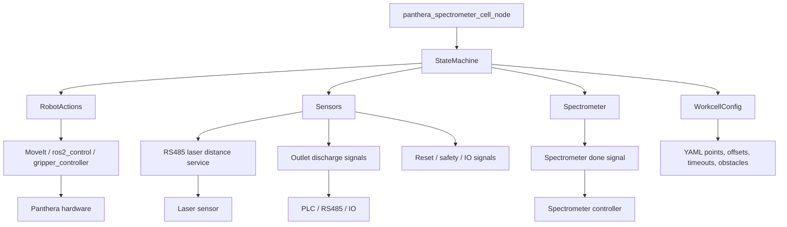
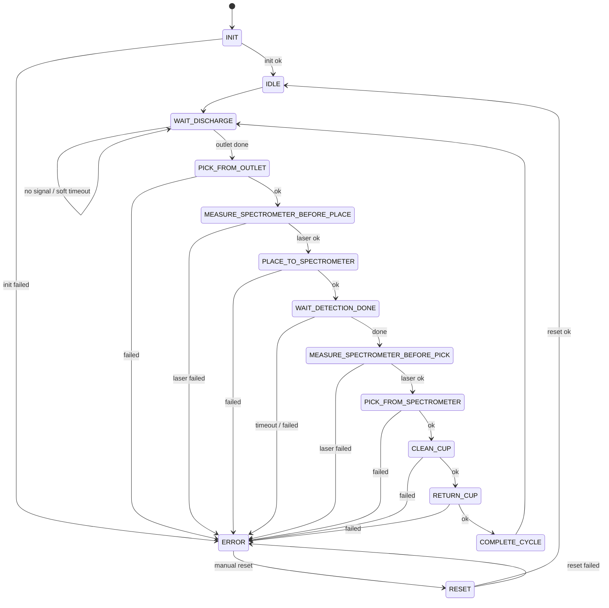

# 光谱检测流水线机械臂长期运行程序设计文档

本文档描述一个用于流水线持续运行的 C++ 机械臂控制程序框架。它面向真实部署，不是“一次服务调用执行完就退出”的固定流程，而是一个长期在线的产线控制节点。

建议新建 ROS2 C++ 包：

```text
panthera_spectrometer_cell
```

该包作为应用层状态机，复用现有工作空间里的硬件、MoveIt、RS485、激光传感器和 IO 包。

## 1. 设计目标

程序需要长期运行，持续等待出料、抓杯、放到光谱仪、等待检测、重新测量光谱仪位置、取回杯子、清理杯子、放回原出料口，然后进入下一轮。

必须保证：

| 要求 | 设计约束 |
| --- | --- |
| 程序持续运行 | 主节点启动后不主动退出，状态机循环 tick。 |
| 每轮杯子要回原出料口 | `CycleContext` 记录 `outletId`，`RETURN_CUP` 必须使用该字段。 |
| 光谱仪位置不能假设固定 | 放杯前、取杯前分别调用激光测量，两次结果分别保存。 |
| 失败不能继续执行 | 任意动作失败进入 `ERROR`，停止机械臂动作，等待人工复位。 |
| 等待不能无限阻塞 | 每个等待状态都有超时参数。 |
| 点位要方便现场微调 | 所有出料口、清理位、光谱仪轴转换、夹爪参数、避障物都放在 YAML 配置里。 |
| 后续容易扩展 | 状态机只负责编排，动作、传感器、光谱仪、配置解析分层。 |

## 2. 为什么不直接继续使用当前 YAML 工作流

现有 `panthera_task_framework` 适合：

- 手动调用 `/run_workflow` 执行一次流程；
- 快速验证一段固定动作；
- 组合一些简单步骤。

但流水线长期运行程序还需要：

- 长期循环；
- 任务上下文；
- 出错停机和人工复位；
- 两个或更多出料口的调度；
- 等待外部设备和超时策略；
- 每一轮记录检测位置、杯子来源、错误原因；
- 未来加入队列、视觉、安全区、互锁。

所以建议新建一个专用 C++ 状态机包 `panthera_spectrometer_cell`，不要把长期运行逻辑继续写成一大段 YAML。

YAML 仍然可以保留，用于配置点位、参数、障碍物和调试动作。

## 3. 总体架构



核心原则：

- `StateMachine` 只做流程判断和状态切换。
- `RobotActions` 只做机械臂动作，不知道完整业务流程。
- `Sensors` 只读传感器和流程信号。
- `Spectrometer` 只处理光谱仪检测状态。
- `Config` 只负责参数和点位。
- 所有动作返回 `ActionResult`，失败必须带原因。

## 4. 推荐文件结构

```text
src/panthera_spectrometer_cell/
  CMakeLists.txt
  package.xml

  include/panthera_spectrometer_cell/
    Types.h
    Config.h
    StateMachine.h
    RobotActions.h
    Sensors.h
    Spectrometer.h

  src/
    main.cpp
    Config.cpp
    StateMachine.cpp
    RobotActions.cpp
    Sensors.cpp
    Spectrometer.cpp

  config/
    spectrometer_cell.yaml
    collision_objects.yaml

  launch/
    spectrometer_cell.launch.py

  README.md
```

后续可以扩展：

```text
  include/panthera_spectrometer_cell/
    SafetyMonitor.h
    CupScheduler.h
    VisionProvider.h
    Diagnostics.h

  src/
    SafetyMonitor.cpp
    CupScheduler.cpp
    VisionProvider.cpp
    Diagnostics.cpp
```

## 5. 状态定义

建议状态枚举：

```cpp
enum class State
{
    INIT,
    IDLE,
    WAIT_DISCHARGE,
    PICK_FROM_OUTLET,
    MEASURE_SPECTROMETER_BEFORE_PLACE,
    PLACE_TO_SPECTROMETER,
    WAIT_DETECTION_DONE,
    MEASURE_SPECTROMETER_BEFORE_PICK,
    PICK_FROM_SPECTROMETER,
    CLEAN_CUP,
    RETURN_CUP,
    COMPLETE_CYCLE,
    ERROR,
    RESET
};
```

这个状态集合是合理的。后续如果增加多个杯子队列，可以在 `WAIT_DISCHARGE` 前后增加 `SELECT_NEXT_TASK`，而不是改动所有状态。

## 6. 出料口定义

```cpp
enum class OutletId
{
    NONE,
    OUTLET_1,
    OUTLET_2
};
```

后续增加第三个出料口时，不建议在状态机里写大量 `if outlet == OUTLET_3`。更好的方式是：

```cpp
struct OutletConfig
{
    OutletId id;
    std::string name;
    PoseConfig pickPose;
    PoseConfig returnPose;
    std::string dischargeDoneSignal;
};
```

状态机只保存 `OutletId`，动作层根据配置查点位。

## 7. 动作返回值

```cpp
struct ActionResult
{
    bool success = false;
    std::string message;
};
```

约定：

- 成功时 `success=true`，`message` 可写简短说明。
- 失败时 `success=false`，`message` 必须说明失败动作、目标和原因。

示例：

```text
pickFromOutlet(OUTLET_1) failed: MoveIt planning failed
readSpectrometerPosition failed: laser timeout after 3 retries
returnCupToOutlet(OUTLET_2) failed: safety zone blocked
```

## 8. 当前任务上下文

```cpp
struct CycleContext
{
    OutletId outletId = OutletId::NONE;

    double spectrometerPositionBeforePlace = 0.0;
    double spectrometerPositionBeforePick = 0.0;

    std::string errorMessage;
    std::uint64_t cycleId = 0;
};
```

建议增加：

```cpp
std::chrono::steady_clock::time_point cycleStartTime;
std::chrono::steady_clock::time_point stateEnterTime;
```

用途：

- 记录一轮耗时；
- 处理状态超时；
- 日志排查；
- 后续和 MES/上位机对接。

关键约束：

- `outletId` 在 `WAIT_DISCHARGE` 里确定；
- `PICK_FROM_OUTLET`、`RETURN_CUP` 都必须使用同一个 `outletId`；
- `spectrometerPositionBeforePlace` 只用于放杯；
- `spectrometerPositionBeforePick` 只用于取杯；
- 取杯前必须重新测量，不允许复用放杯前数值。

## 9. 状态机流程



## 10. 每个状态的职责

### INIT

职责：

- 加载配置；
- 初始化 MoveIt、夹爪、传感器客户端、光谱仪信号；
- 可选执行一次安全回零或检查控制器状态。

成功：

```text
INIT -> IDLE
```

失败：

```text
INIT -> ERROR
```

### IDLE

职责：

- 清空上一轮上下文；
- 创建新的 `cycleId`；
- 不执行机械臂动作。

切换：

```text
IDLE -> WAIT_DISCHARGE
```

### WAIT_DISCHARGE

职责：

- 读取两个出料口的出料完成信号；
- 如果 `OUTLET_1` 完成，记录 `context.outletId = OUTLET_1`；
- 如果 `OUTLET_2` 完成，记录 `context.outletId = OUTLET_2`；
- 如果都没完成，继续等待；
- 软超时只打印提示，不退出程序。

两个出料口同时完成时建议策略：

1. 默认优先 `OUTLET_1`；
2. 或按上一次处理位置轮换；
3. 后续升级为 `CupScheduler` 队列。

当前第一版建议先用固定优先级，配置里注明。

### PICK_FROM_OUTLET

调用：

```cpp
robot.pickFromOutlet(context.outletId)
```

动作层需要：

- 根据 `outletId` 查找取杯点位；
- 打开夹爪；
- 到预抓点；
- 到抓取点；
- 闭合夹爪；
- 抬起到安全高度。

失败进入 `ERROR`。

### MEASURE_SPECTROMETER_BEFORE_PLACE

调用：

```cpp
sensors.readSpectrometerPosition()
```

成功后写入：

```cpp
context.spectrometerPositionBeforePlace = result.position;
```

注意：

- 这里是放杯前测量；
- 得到的是光谱仪沿固定轴的位置；
- 需要通过配置转换为机械臂放杯坐标。

### PLACE_TO_SPECTROMETER

调用：

```cpp
robot.placeToSpectrometer(context.spectrometerPositionBeforePlace)
```

动作层负责：

- 把激光测量值转换成实际放杯位姿；
- 规划到光谱仪上方；
- 下放；
- 松开夹爪；
- 离开安全高度。

失败进入 `ERROR`。

### WAIT_DETECTION_DONE

调用：

```cpp
spectrometer.waitDetectionDone(config.detectionTimeout)
```

必须有超时。

失败或超时进入 `ERROR`，不能直接取杯。

### MEASURE_SPECTROMETER_BEFORE_PICK

再次调用：

```cpp
sensors.readSpectrometerPosition()
```

成功后写入：

```cpp
context.spectrometerPositionBeforePick = result.position;
```

这是关键状态：

- 不能使用 `spectrometerPositionBeforePlace`；
- 因为检测完成后光谱仪可能停在新位置；
- 取杯坐标必须使用重新测量的值。

### PICK_FROM_SPECTROMETER

调用：

```cpp
robot.pickFromSpectrometer(context.spectrometerPositionBeforePick)
```

动作层负责：

- 根据新测量位置计算取杯位姿；
- 到取杯预位；
- 下探夹杯；
- 闭合夹爪；
- 抬起。

失败进入 `ERROR`。

### CLEAN_CUP

调用：

```cpp
robot.cleanCup()
```

动作层负责：

- 到固定清理位置；
- 翻转杯子；
- 可选抖动；
- 回正；
- 离开清理区。

清理动作必须配置速度和角度限制，避免甩料或碰撞。

### RETURN_CUP

调用：

```cpp
robot.returnCupToOutlet(context.outletId)
```

关键约束：

- 必须放回原出料口；
- 不允许根据当前最近点或默认点放杯；
- 如果 `context.outletId == NONE`，直接进入 `ERROR`。

### COMPLETE_CYCLE

职责：

- 记录本轮完成；
- 清空上下文；
- 回到等待出料。

切换：

```text
COMPLETE_CYCLE -> WAIT_DISCHARGE
```

### ERROR

职责：

- 立即调用 `robot.stop()`；
- 记录 `context.errorMessage`；
- 发布错误状态；
- 等待人工复位信号。

不允许：

- 自动继续下一步；
- 自动清空错误；
- 自动移动机械臂，除非进入 `RESET` 后明确执行复位动作。

### RESET

职责：

- 调用 `robot.reset()`；
- 重新检查机械臂、夹爪、传感器；
- 成功后进入 `IDLE`。

如果复位失败，回到 `ERROR`。

## 11. 类职责设计

### StateMachine

只负责编排。

主要接口：

```cpp
class StateMachine
{
public:
    void tick();
    State currentState() const;

private:
    void transitionTo(State next);
    void fail(const std::string& message);

    void handleInit();
    void handleIdle();
    void handleWaitDischarge();
    void handlePickFromOutlet();
    void handleMeasureBeforePlace();
    void handlePlaceToSpectrometer();
    void handleWaitDetectionDone();
    void handleMeasureBeforePick();
    void handlePickFromSpectrometer();
    void handleCleanCup();
    void handleReturnCup();
    void handleCompleteCycle();
    void handleError();
    void handleReset();
};
```

约束：

- `StateMachine` 不直接写 MoveIt 代码；
- `StateMachine` 不直接读串口；
- `StateMachine` 不直接解析 YAML 细节；
- 每个 `handleXxx()` 保持短小，只做判断、调用动作、切换状态。

### RobotActions

封装所有机械臂动作。

建议接口：

```cpp
class RobotActions
{
public:
    ActionResult initialize();
    ActionResult stop();
    ActionResult reset();

    ActionResult pickFromOutlet(OutletId outletId);
    ActionResult returnCupToOutlet(OutletId outletId);

    ActionResult placeToSpectrometer(double axisPosition);
    ActionResult pickFromSpectrometer(double axisPosition);

    ActionResult cleanCup();
};
```

内部可以分解成更细动作：

```cpp
ActionResult moveToNamedPose(const std::string& name);
ActionResult moveToPose(const PoseConfig& pose);
ActionResult openGripper();
ActionResult closeGripper();
ActionResult applyCollisionObjects();
```

后续真实硬件接入位置：

- MoveIt `MoveGroupInterface`；
- `FollowJointTrajectory` action；
- 夹爪控制器 topic/action；
- PlanningScene 障碍物；
- 速度/加速度缩放；
- 碰撞检测和安全区检查。

### Sensors

封装传感器和外部信号。

建议接口：

```cpp
class Sensors
{
public:
    ActionResult initialize();

    std::optional<OutletId> readDischargeDone();
    MeasurementResult readSpectrometerPosition();
    bool isManualResetRequested();
    bool isEmergencyStopActive();
};
```

其中：

```cpp
struct MeasurementResult
{
    bool success = false;
    double value = 0.0;
    std::string message;
};
```

后续真实硬件接入位置：

- `/sensors/laser/distance` topic；
- `/laser_distance_node/read_once` service；
- `/workflow/external_signal`；
- IO 输入；
- PLC/RS485 状态机。

### Spectrometer

封装光谱仪检测状态。

建议接口：

```cpp
class Spectrometer
{
public:
    ActionResult initialize();
    ActionResult waitDetectionDone(std::chrono::milliseconds timeout);
};
```

第一版可以用模拟信号。真实接入时可以来自：

- RS485；
- IO；
- TCP/串口；
- ROS topic；
- PLC 状态位。

## 12. 配置文件设计

建议配置文件：

```text
config/spectrometer_cell.yaml
```

建议结构：

```yaml
loop:
  tick_rate_hz: 10
  wait_discharge_soft_timeout_sec: 10.0
  detection_timeout_sec: 120.0
  reset_timeout_sec: 30.0

motion:
  velocity_scale: 0.10
  acceleration_scale: 0.10
  planning_time_sec: 5.0
  planning_attempts: 5

gripper:
  open_position: 0.045
  close_position: 0.002
  open_duration_sec: 1.5
  close_duration_sec: 1.5

outlets:
  OUTLET_1:
    discharge_signal: outlet_1_done
    pick_approach_pose: outlet_1_pick_approach
    pick_pose: outlet_1_pick
    return_approach_pose: outlet_1_return_approach
    return_pose: outlet_1_return

  OUTLET_2:
    discharge_signal: outlet_2_done
    pick_approach_pose: outlet_2_pick_approach
    pick_pose: outlet_2_pick
    return_approach_pose: outlet_2_return_approach
    return_pose: outlet_2_return

spectrometer_axis:
  laser_min_mm: 120.0
  laser_max_mm: 280.0
  axis_zero_laser_mm: 120.0
  axis_scale_m_per_mm: 0.001
  base_pose_name: spectrometer_base
  axis: x
  place_offset_xyz: [0.0, 0.0, 0.0]
  pick_offset_xyz: [0.0, 0.0, 0.0]

cleaning:
  approach_pose: clean_approach
  dump_pose: clean_dump
  shake_count: 2
  shake_angle_rad: 0.15
  leave_pose: clean_leave

named_poses:
  outlet_1_pick_approach:
    xyz: [0.300, 0.100, 0.250]
    rpy: [3.1416, 0.0, 0.0]

  outlet_1_pick:
    xyz: [0.300, 0.100, 0.120]
    rpy: [3.1416, 0.0, 0.0]

  outlet_2_pick_approach:
    xyz: [0.300, -0.100, 0.250]
    rpy: [3.1416, 0.0, 0.0]

  outlet_2_pick:
    xyz: [0.300, -0.100, 0.120]
    rpy: [3.1416, 0.0, 0.0]

  spectrometer_base:
    xyz: [0.500, 0.000, 0.180]
    rpy: [3.1416, 0.0, 0.0]

  clean_approach:
    xyz: [0.100, 0.300, 0.250]
    rpy: [3.1416, 0.0, 0.0]

  clean_dump:
    xyz: [0.100, 0.300, 0.180]
    rpy: [3.1416, 0.0, 1.5708]
```

## 13. 点位微调策略

现场调试时，最容易变化的是点位，不应该改 C++ 源码。

建议：

- 所有点位放 `named_poses`；
- 每个动作只引用点位名；
- 出料口配置只关心点位名；
- 光谱仪动态点位通过 `spectrometer_axis` 计算；
- 清理动作通过 `cleaning` 配置；
- 点位改完后重启节点或调用 reload 服务。

后续可以增加一个点位调试工具：

```bash
ros2 service call /spectrometer_cell/move_to_named_pose ...
ros2 service call /spectrometer_cell/save_current_pose ...
```

第一版不一定要做保存当前点位，但代码结构要允许后续加。

## 14. 光谱仪动态坐标计算

光谱仪只沿固定轴移动。激光读数到机械臂坐标的转换建议集中在 `RobotActions` 或 `CoordinateMapper` 中，不要写在状态机里。

计算逻辑示例：

```text
axis_delta_m = (laser_mm - axis_zero_laser_mm) * axis_scale_m_per_mm
target_pose = spectrometer_base_pose
target_pose.axis += axis_delta_m
target_pose.xyz += place_offset_xyz 或 pick_offset_xyz
```

放杯：

```cpp
robot.placeToSpectrometer(context.spectrometerPositionBeforePlace);
```

取杯：

```cpp
robot.pickFromSpectrometer(context.spectrometerPositionBeforePick);
```

注意：

- 放杯和取杯可以使用不同 offset；
- 取杯前必须重新读激光；
- 激光值必须检查范围，例如 120 到 280 mm；
- 超出范围直接失败进入 `ERROR`。

## 15. 障碍物配置

建议单独配置：

```text
config/collision_objects.yaml
```

示例：

```yaml
collision_objects:
  conveyor:
    type: box
    frame_id: base_link
    xyz: [0.35, 0.0, 0.02]
    rpy: [0.0, 0.0, 0.0]
    size_xyz: [0.80, 0.30, 0.04]

  spectrometer_body:
    type: box
    frame_id: base_link
    xyz: [0.55, 0.0, 0.08]
    rpy: [0.0, 0.0, 0.0]
    size_xyz: [0.30, 0.25, 0.16]

  outlet_1_fixture:
    type: cylinder
    frame_id: base_link
    xyz: [0.30, 0.10, 0.06]
    radius: 0.04
    height: 0.12
```

障碍物原则：

- 全部从 YAML 加载；
- 启动时统一加入 MoveIt PlanningScene；
- 后续可以支持启用/禁用某个障碍物；
- 不要在 C++ 里硬编码障碍物尺寸。

## 16. 等待和超时策略

所有等待都必须有超时。

建议分两类：

| 类型 | 示例 | 超时后行为 |
| --- | --- | --- |
| 软超时 | 等待出料信号 | 打印提示，继续等待，不退出。 |
| 硬超时 | 等待光谱仪检测完成、等待复位动作、等待传感器读数 | 进入 `ERROR`。 |

`WAIT_DISCHARGE` 是长期等待状态，不能因为没物料就停机。它可以每 10 秒打印一次：

```text
waiting discharge signal: no outlet ready for 10.0s
```

`WAIT_DETECTION_DONE` 是硬超时，因为杯子已经放到光谱仪上，如果检测一直不完成，继续执行会有风险。

## 17. 错误和人工复位

错误处理原则：

1. 任意动作失败立即进入 `ERROR`；
2. `ERROR` 中只做停止和等待复位；
3. 复位必须来自人工确认信号；
4. 收到复位后进入 `RESET`；
5. `RESET` 成功后回到 `IDLE`；
6. `RESET` 失败继续进入 `ERROR`。

建议状态发布：

```text
/spectrometer_cell/state
/spectrometer_cell/error
/spectrometer_cell/context
```

也可以复用现有：

```text
/workflow/status
```

但长期程序最好有自己的状态 topic，避免和一次性 workflow executor 混淆。

## 18. 主循环设计

`main.cpp` 保持简单：

```cpp
int main(int argc, char** argv)
{
    rclcpp::init(argc, argv);

    auto node = std::make_shared<rclcpp::Node>("panthera_spectrometer_cell");

    auto config = WorkcellConfig::loadFromRosParameters(node);
    auto robot = std::make_shared<RobotActions>(node, config);
    auto sensors = std::make_shared<Sensors>(node, config);
    auto spectrometer = std::make_shared<Spectrometer>(node, config);

    StateMachine sm(node, config, robot, sensors, spectrometer);

    rclcpp::Rate rate(config.loop.tickRateHz);
    while (rclcpp::ok()) {
        rclcpp::spin_some(node);
        sm.tick();
        rate.sleep();
    }

    robot->stop();
    rclcpp::shutdown();
    return 0;
}
```

后续如果 `RobotActions` 使用 MoveIt action 或服务等待，建议用 `MultiThreadedExecutor`，避免长动作阻塞传感器回调。

## 19. 第一版模拟实现建议

第一版可以先不接真实硬件：

- `RobotActions` 用 sleep 模拟动作；
- `Sensors` 随机生成出料口完成信号；
- `Sensors::readSpectrometerPosition()` 随机返回 120 到 280 mm；
- `Spectrometer::waitDetectionDone()` sleep 后返回成功；
- 随机注入少量失败，测试 ERROR/RESET。

模拟模式建议由配置开关控制：

```yaml
simulation:
  enabled: true
  random_failure_rate: 0.02
  fake_detection_time_sec: 3.0
```

这样同一套状态机后续可以从模拟切换到真实硬件。

## 20. 后续真实硬件接入顺序

建议按这个顺序推进：

1. 实现纯 C++ 模拟状态机，跑 100 轮不崩溃；
2. 接入真实激光读数，但机械臂动作仍模拟；
3. 接入出料完成信号和人工复位信号；
4. 接入光谱仪检测完成信号；
5. 接入机械臂空载动作；
6. 接入夹杯动作；
7. 加入障碍物和速度限制；
8. 做真实连续运行测试；
9. 加入日志、统计、状态上报；
10. 再考虑队列、视觉、多出料口扩展。

## 21. 与现有工作空间的关系

当前工作空间：

```text
/home/b1/panthera_workcell_ws
```

已有包职责：

| 包 | 是否复用 | 方式 |
| --- | --- | --- |
| `panthera_hardware` | 复用 | 继续作为 ros2_control 硬件接口。 |
| `panthera_ht_config` | 复用 | 继续使用 MoveIt、控制器、限位、夹爪力矩配置。 |
| `panthera_rs485` | 复用 | 读取激光、流程状态信号。 |
| `panthera_io` | 复用 | 后续读取 IO 复位、出料、互锁。 |
| `panthera_interfaces` | 复用/扩展 | 可增加长期状态机专用 msg/srv。 |
| `panthera_task_framework` | 保留 | 作为调试和单次动作验证工具，不作为主产线循环程序。 |

新包：

```text
panthera_spectrometer_cell
```

负责实际项目主流程。

## 22. 建议的最小可运行版本

第一版代码只需要实现：

- `Types.h`
- `Config.h/.cpp`
- `RobotActions.h/.cpp`
- `Sensors.h/.cpp`
- `Spectrometer.h/.cpp`
- `StateMachine.h/.cpp`
- `main.cpp`
- `config/spectrometer_cell.yaml`
- `launch/spectrometer_cell.launch.py`

第一版不接真实 MoveIt 也可以，但接口要保持真实可替换。

完成后验证：

```bash
ros2 launch panthera_spectrometer_cell spectrometer_cell.launch.py simulation:=true
```

观察日志：

```text
INIT
IDLE
WAIT_DISCHARGE
PICK_FROM_OUTLET OUTLET_1
MEASURE_SPECTROMETER_BEFORE_PLACE position=...
PLACE_TO_SPECTROMETER
WAIT_DETECTION_DONE
MEASURE_SPECTROMETER_BEFORE_PICK position=...
PICK_FROM_SPECTROMETER
CLEAN_CUP
RETURN_CUP OUTLET_1
COMPLETE_CYCLE
WAIT_DISCHARGE
```

重点确认：

- 程序不会一轮后退出；
- 放杯前和取杯前有两次不同激光测量；
- `RETURN_CUP` 使用的是原始 `outletId`；
- 失败进入 `ERROR`；
- 复位后能回到 `IDLE`；
- 所有点位都在 YAML 里改。

## 23. 我建议下一步讨论的问题

在写代码前，需要确认这些工程决策：

1. 出料完成信号第一版来自 RS485 还是 IO？
2. 人工复位信号来自按钮 IO、RS485 状态码，还是先用 ROS service？
3. 光谱仪检测完成信号来自哪里？
4. 光谱仪轴方向在机械臂坐标系里是 `x`、`y` 还是 `z`？
5. 杯子抓取是固定姿态夹取，还是需要根据杯子偏移修正？
6. 清理动作是否需要抖动，抖动幅度和次数是否可调？
7. 是否需要“两个出料口同时完成”的队列策略？

我建议第一版先用：

- 出料信号：模拟，后续接 RS485/IO；
- 复位信号：ROS service，后续接按钮；
- 光谱仪完成：模拟，后续接 RS485/IO；
- 机械臂动作：模拟，接口先按真实 MoveIt 设计；
- 点位：全部 YAML 配置；
- 障碍物：YAML 配置但第一版只加载不强制复杂逻辑。

这样可以先把长期运行状态机跑稳，再逐步接入真实硬件。
